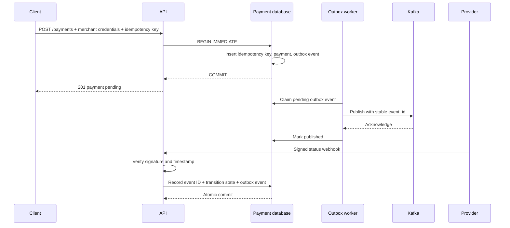
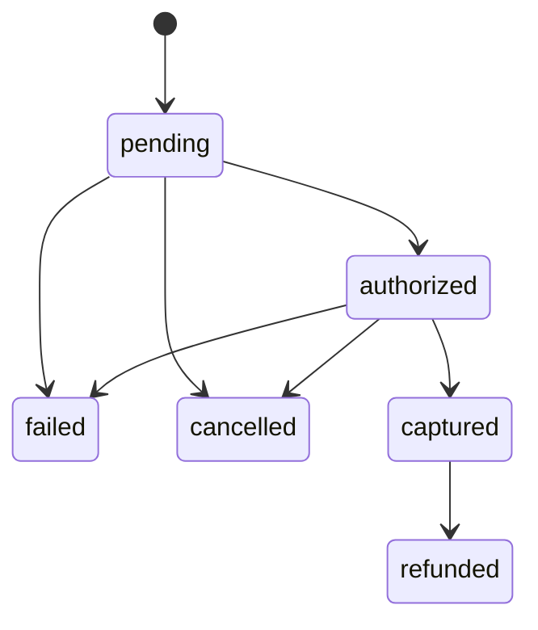

# Scalable Payment Gateway

[](https://github.com/KevanMehta/scalable-payment-gateway/actions/workflows/ci.yml)
[](LICENSE)

A payment-platform reference implementation focused on correctness at failure-prone boundaries: duplicate requests, provider webhooks, state transitions, asynchronous events, and reconciliation.

> This project processes synthetic tokens only. It does not connect to card networks, store card numbers, or move money.

## Why Payment Gateways Require Idempotency

Clients retry when connections time out, even when the server may have committed the original request. Without idempotency, the retry can create a second authorization or charge.

`POST /payments` therefore requires an `Idempotency-Key`. The key is scoped to the authenticated merchant and stored in the same database transaction as the payment and its initial outbox event:

- the first request creates one payment;
- an identical retry returns the original response;
- reuse with a different payload returns a conflict; and
- concurrent requests serialize around the unique `(merchant_id, idempotency_key)` constraint.

This gives effectively-once payment creation inside the database boundary. It cannot make external systems exactly-once. Provider calls and event consumers must also accept idempotency identifiers and deduplicate stable event IDs.

## Implemented Capabilities

- Merchant-scoped API-key authentication with constant-time secret comparison
- Required idempotency keys and atomic duplicate-payment prevention
- Integer minor-unit storage for monetary amounts
- Explicit payment state machine with optimistic version checks
- HMAC-SHA256 webhook verification, timestamp tolerance, and replay protection
- Transactional outbox committed with payment state changes
- At-least-once outbox worker with exponential retry, stale-claim recovery, and dead-letter state
- Operator-controlled dead-letter requeue
- Kafka publisher adapter using stable event IDs and `acks=all`
- Saga step retry and reverse-order compensation with surfaced compensation failures
- Reconciliation jobs that persist missing-provider and status-mismatch findings
- Per-process merchant/IP sliding-window rate limiting
- Tests for duplicate, concurrent, rollback, network-failure, retry, replay, and recovery paths

## Transaction Flow



The state machine permits:



Invalid transitions return a conflict and do not write an event.

## Reliability Model

### Transactional outbox

Payment state and event intent are written in one transaction. A worker later publishes the event and marks it complete. This prevents the classic failure where the database commits but the event is never recorded.

Publishing is **at-least-once**: a worker can publish successfully and crash before marking the event complete. Every message contains a stable `event_id`; consumers must store processed IDs with their own business update to make handling effectively once.

Failed publications use exponential backoff. After the configured attempt limit, the event enters `dead_letter`. Requeue is explicit so an operator can first correct the underlying dependency or payload problem. Claims abandoned by a crashed worker can be returned to `pending` with `recover_stale_outbox`.

### Webhooks

Provider webhooks are authenticated over the exact raw body using HMAC-SHA256. Signatures include a timestamp and are rejected outside a five-minute window. The provider event ID has a unique database constraint, so a valid replay cannot apply a state transition twice.

### Reconciliation

`ReconciliationJob` compares an internal payment snapshot with provider statuses and persists each mismatch plus run totals. It reports discrepancies; it does not automatically mutate payment state because provider data can be incomplete or delayed and should be reviewed under an explicit repair policy.

## Security

- Configure merchant keys with `PAYMENT_API_KEYS`, a JSON object mapping merchant IDs to secrets.
- Configure webhook signing with `PAYMENT_WEBHOOK_SECRET`.
- Use synthetic opaque tokens only; `card_token` is validated at the boundary and deliberately not persisted.
- Payment lookup and cancellation are restricted to the authenticated merchant.
- The included rate limiter is process-local and is not sufficient for multiple API replicas.
- TLS termination, secret rotation, audit access controls, PCI DSS scope, and provider credential management are deployment responsibilities not implemented here.

See [SECURITY.md](SECURITY.md) for reporting instructions and the complete threat assumptions.

## Local Development

Python 3.11 is used by CI.

```bash
python3.11 -m venv .venv
source .venv/bin/activate
python -m pip install -r requirements-dev.txt
PYTHONPATH=api-gateway:fraud-detection python -m pytest api-gateway/tests fraud-detection/tests -q
```

Run the API with a local SQLite database:

```bash
export PAYMENT_API_KEYS='{"merchant_demo":"replace-with-a-local-secret"}'
export PAYMENT_WEBHOOK_SECRET='replace-with-a-different-local-secret'
export PAYMENT_DATABASE_PATH='./payment_gateway.db'
uvicorn app.main:app --app-dir api-gateway --host 127.0.0.1 --port 8000
```

Create a synthetic payment:

```bash
curl -X POST http://127.0.0.1:8000/payments \
  -H 'Content-Type: application/json' \
  -H 'X-Merchant-Id: merchant_demo' \
  -H 'X-API-Key: replace-with-a-local-secret' \
  -H 'Idempotency-Key: checkout-session-12345' \
  -d '{"amount":"19.95","currency":"USD","merchant_id":"merchant_demo","card_token":"tok_synthetic"}'
```

## Testing

The suite exercises:

- identical and conflicting idempotency-key reuse;
- eight concurrent submissions for the same logical payment;
- rollback of the payment, key, and outbox event after an injected failure;
- valid and invalid state transitions;
- duplicate provider references;
- valid, tampered, stale, and replayed webhooks;
- network failures, retry exhaustion, dead-lettering, and requeue;
- one-time publication behavior after acknowledgement;
- reconciliation mismatches;
- saga retry and reverse compensation order; and
- rate-limit and merchant-key isolation.

CI compiles Python sources, runs the API/reliability and fraud-rule tests, checks Terraform formatting, and parses Kubernetes YAML. It does not deploy infrastructure.

## Architecture and Tradeoffs

- **SQLite keeps the correctness model runnable locally.** `BEGIN IMMEDIATE`, unique constraints, and WAL mode make concurrency behavior testable without services. SQLite is a single-node database; PostgreSQL with equivalent constraints and transaction boundaries is the appropriate next step for multiple API replicas.
- **The outbox separates commits from delivery.** This avoids dual writes but accepts at-least-once delivery and requires consumer deduplication.
- **API keys keep merchant isolation explicit.** A deployed platform would use hashed/rotatable credentials, scoped authorization, and managed secret storage.
- **The rate limiter is deliberately local.** It protects a single process only; a shared Redis-backed limiter or gateway policy is needed across replicas.
- **Reconciliation reports rather than repairs.** Automatic repair risks overwriting correct internal state with delayed provider data.
- **The saga is in-process.** It retries and compensates predictably but cannot survive a process restart. Durable workflow execution needs persisted checkpoints or a workflow engine.
- **Kafka is an adapter, not a local requirement.** Core tests use a deterministic publisher function and do not require a broker.

Architecture decisions are expanded in [docs/decisions.md](docs/decisions.md).

## Project Structure

| Path | Purpose |
| --- | --- |
| `api-gateway/app/main.py` | Authenticated HTTP endpoints and validation |
| `api-gateway/app/store.py` | Schema, transactions, state machine, idempotency, outbox, and reconciliation persistence |
| `api-gateway/app/webhooks.py` | Webhook signing, verification, parsing, and replay-safe processing |
| `api-gateway/app/security.py` | Merchant credential verification |
| `api-gateway/app/rate_limit.py` | Single-process sliding-window limiter |
| `api-gateway/tests/` | Correctness, concurrency, security, and failure-recovery tests |
| `payment-service/outbox_worker.py` | Outbox delivery, retry, and DLQ orchestration |
| `payment-service/events.py` | Kafka publisher adapter |
| `payment-service/saga.py` | Retrying saga executor and compensation handling |
| `reconciliation/job.py` | Provider-snapshot comparison job |
| `fraud-detection/` | Separate rule-engine example |
| `infra/`, `k8s/` | Partial deployment configuration; not a complete environment |

## Benchmarking

No throughput or latency results are claimed. The Locust file is an authenticated workload definition only; it is not benchmark evidence.

A credible benchmark should use a defined database and CPU allocation, unique and repeated idempotency keys, fixed concurrency and ramp-up, and a recorded commit SHA. Report request counts, error classifications, latency percentiles, database saturation, and the exact Locust command. Separate new-payment results from idempotent replays.

## Future Improvements

- Port the store to PostgreSQL and run concurrency tests against the same engine used in deployment
- Add a durable workflow runner with persisted saga checkpoints
- Add consumer-side inbox/deduplication storage and Kafka integration tests
- Add API-key hashing, rotation, fine-grained scopes, and audit logging
- Schedule reconciliation with provider pagination, checkpointing, and operator repair workflows
- Replace the local rate limiter with a shared policy and return standard rate-limit headers
- Complete provider sandbox integration and contract tests without introducing real card data
- Finish or remove the partial Terraform, Kubernetes, frontend, and model-backed fraud examples

## Contributing

See [CONTRIBUTING.md](CONTRIBUTING.md). Report suspected vulnerabilities privately as described in [SECURITY.md](SECURITY.md).

## License

This project is licensed under the [MIT License](LICENSE).
