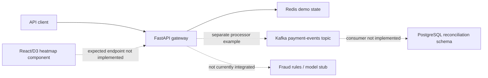

# Scalable Payment Gateway

[](https://github.com/KevanMehta/scalable-payment-gateway/actions/workflows/ci.yml)
[](LICENSE)

A portfolio reference implementation exploring common payment-system patterns across API, fraud screening, event delivery, reconciliation, and deployment configuration.

> This repository is a collection of focused examples, not a runnable end-to-end payment processor. It does not contact card networks or move money.

## Why I Built This

I built this project to study how payment systems divide responsibilities at service boundaries: accepting a payment request, preventing duplicate work, screening simple fraud signals, emitting events, compensating failed workflow steps, and reconciling stored records. The repository also explores how those components can be described for containers, Kubernetes, and AWS without treating the examples as a complete deployment.

## Features

- FastAPI payment endpoint with request validation, a fixed high-value fraud rule, transaction IDs, and Redis-backed demo state
- Redis idempotency middleware and a separate payment processor example with Kafka event emission
- Rule-based fraud scoring with unit-test coverage for the high-value/new-recipient rule
- In-process saga coordinator with reverse-order compensation
- PostgreSQL reconciliation schema managed as a Flyway migration
- React/D3 fraud heatmap component that expects a fraud-statistics API
- Kubernetes Deployment, Service, and HorizontalPodAutoscaler examples
- Terraform examples for a VPC and EKS cluster
- Locust workload definition for exercising the payment endpoint

## Architecture

The code is organized as examples of the main boundaries in a payment flow. Several connections shown below are design intent rather than a fully wired local runtime.



The primary request path is `POST /payments`. It rejects amounts above 10,000, writes a generated transaction record to Redis, and returns the transaction ID. No external payment provider is called.

## Engineering Decisions

- **FastAPI for the API boundary.** Pydantic models keep the request contract visible and provide validation with little framework code. A larger service might choose Spring Boot or another framework when deeper platform standardization outweighs the smaller Python surface.
- **Redis for ephemeral examples.** Redis makes duplicate-request and short-lived transaction-state patterns easy to demonstrate. It is not used here as a durable financial ledger; PostgreSQL or another transactional store would be required for authoritative payment records.
- **Kafka for event-publication examples.** The payment processor and event helper show an asynchronous `payment-events` boundary. Delivery confirmation, retries, consumers, and an outbox are not implemented, so the examples do not guarantee event delivery.
- **Saga compensation for workflow failure.** The coordinator records completed steps and compensates them in reverse order. It is intentionally in-process; a durable workflow engine would be more appropriate when execution must survive process restarts.
- **PostgreSQL and Flyway for reconciliation data.** The schema uses relational constraints and indexed query fields, while a versioned migration makes the database change explicit. The repository contains the migration but no reconciliation application.
- **Kubernetes and Terraform as deployment sketches.** These files expose scaling and infrastructure concerns without claiming a complete deployment. Docker Compose was not added because the repository does not yet contain enough complete services to support an honest one-command environment.

More detail is captured in [docs/decisions.md](docs/decisions.md).

## Tradeoffs

- Payment processing is simulated by a Redis write; there is no provider integration, authorization, capture, settlement, refund, or ledger.
- Idempotency middleware exists but is not registered with the FastAPI application. Its cached response also omits status and headers.
- Fraud evaluation is split between a tested rule engine and an incomplete model-backed service. The checked-in `ml_model.pkl` is a placeholder, not a trained model artifact.
- Kafka publication is illustrative and is not connected to the main endpoint. The code has no consumer, schema management, outbox, retry, or dead-letter handling.
- The frontend contains one component but no complete application or implemented `/api/fraud-stats` endpoint.
- Terraform references an IAM role that is not defined, and the Kubernetes manifests assume an image and Redis service that are not supplied. They are not directly deployable as checked in.
- Monetary amounts use floating-point values in the API example. A real payment boundary should use integer minor units or a decimal type with an explicit currency.

## Running the Implemented Examples

### Fraud rule unit test

From the repository root:

```bash
python -m pip install -r fraud-detection/requirements.txt pytest
PYTHONPATH=fraud-detection python -m pytest fraud-detection/tests -q
```

### API example

The API requires a Redis instance resolvable as `redis` on port `6379`. From `api-gateway/`:

```bash
python -m pip install -r requirements.txt
uvicorn app.main:app --host 0.0.0.0 --port 8000
```

Example request:

```bash
curl -X POST http://localhost:8000/payments \
  -H 'Content-Type: application/json' \
  -d '{"amount":100,"card_token":"tok_demo","merchant_id":"merchant_demo"}'
```

Use synthetic tokens only. This example stores data in Redis and does not process a real payment.

The root `setup.sh` is retained as an early environment sketch, but it is not runnable because a Compose file and migration service are not present.

## Testing

- `fraud-detection/tests/test_rules.py` is a unit test for one fraud rule and runs in CI.
- `api-gateway/tests/test_payments.py` is an API-level test sketch. It expects an already-running API and Redis instance and is not part of CI.
- CI compiles the Python sources, runs the fraud-rule test, checks Terraform formatting, and parses the Kubernetes YAML files.
- No integration, browser, end-to-end, infrastructure deployment, or measured coverage suite is currently present.

No benchmark results are claimed. The Locust file is a workload starting point; its wait time is not evidence of throughput. A useful benchmark would pin the runtime and infrastructure, generate unique idempotency keys, report latency percentiles and error rate, and publish the exact command and environment with the results.

## Project Structure

| Path | Purpose |
| --- | --- |
| `api-gateway/` | FastAPI endpoint, idempotency example, processor example, and API test sketch |
| `fraud-detection/` | Rule engine, model-service stub, and rule test |
| `payment-service/` | Kafka event helper and in-process saga coordinator |
| `reconciliation/` | Maven dependency sketch and Flyway schema migration |
| `frontend/` | React/D3 heatmap component and container sketch |
| `infra/` | Partial AWS VPC and EKS Terraform configuration |
| `k8s/` | API Deployment, Service, and autoscaling examples |
| `load-test/` | Locust workload definition; no published results |
| `docs/` | Architecture decision records |
| `.github/` | CI, contribution templates, and dependency-update configuration |

## Future Improvements

- Define one runnable local path with Compose, health checks, and deterministic test data
- Wire idempotency and fraud evaluation into the API with atomic Redis operations
- Replace float amounts with currency plus integer minor units or fixed-precision decimals
- Add a durable payment record and transactional outbox before connecting Kafka consumers
- Complete the model artifact workflow, or remove the unfinished ML path in favor of rules only
- Add integration tests for Redis and Kafka and contract tests for payment events
- Complete and validate the Terraform and Kubernetes configurations in a non-deploying CI plan

## Contributing

See [CONTRIBUTING.md](CONTRIBUTING.md) for development and review expectations. Security issues should follow [SECURITY.md](SECURITY.md), not the public issue tracker.

## License

This project is licensed under the [MIT License](LICENSE).
